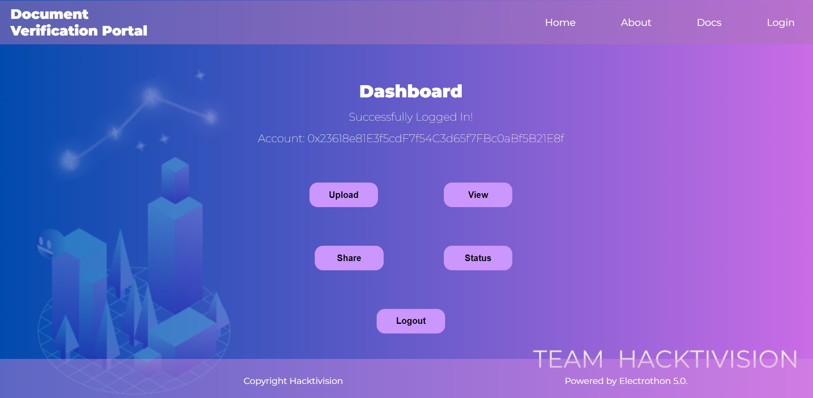
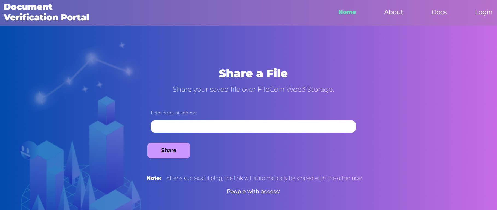
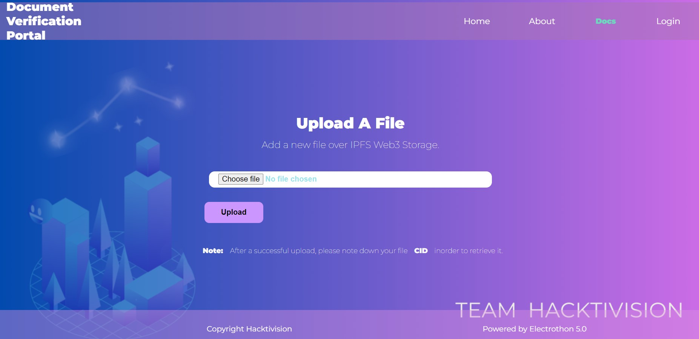
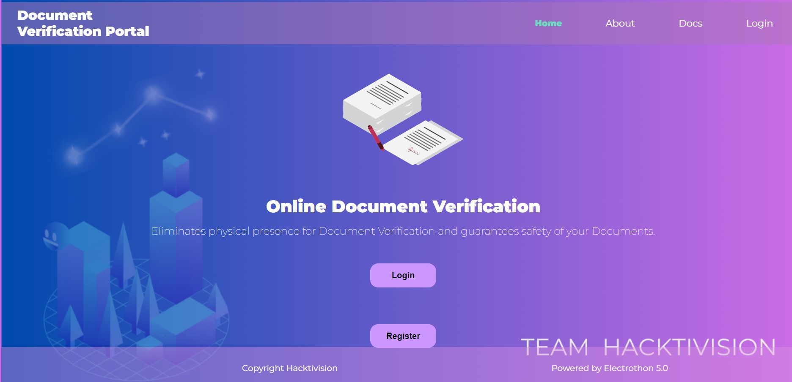
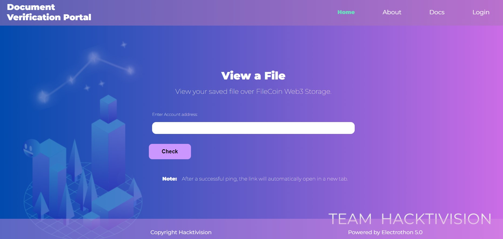

# BlockDoc: BlockChain based Document Verification and Sharing system

## Description

The project provides a portal for document peer-to-peer document sharing and for verification via an admin as well.
 The project is based on Solidity, IPFS, HTML, CSS, Tailwind CSS, and Bootstrap.
 
Our project involves features like Document submission, document sharing and document verification on the blockchain network. It also provides realtime status tracking of the document verification.
The project is entirely based on Web3 frameworks and uses IPFS file storage system which encrypts the file into hashes and makes it impossible to tamper them by immutability. IPFS is a decentralized peer-to-peer file storage system which enables the users to access and store the files on a distributed network of computers instead of a centralised server.
The decentralized approach of file storage and sharing provides greater security resilience, and accesbility than traditional client server models.

## Getting Started
- One needs to make an account on Metamask.
- Install hardhat and deploy the smart contract as available in project files.

### Dependencies

- check package.json

### Installing

npm install hardhat

npx hardhat node

npx hardhat run --network localhost scripts/deploy.js.

Launch in VS code.

### Challenges we ran into:
- We were not familiar with the Blockchain technology at first, so the major challenge was in learned the technology in order to complete our project.
- One of the major challenge we faced was using Metamask, a Ethereum wallet for the transactions. It gives a error if the number of transactions within a specified time limit are exceeded.
- Also, we faced issue in deploying our smart contract.
## Authors

Parth Saini and Samriddh Singh

The project utilities are self explanatory, can be seen here:

